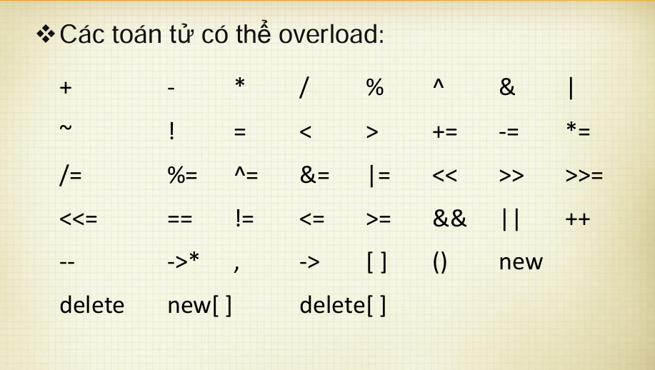

# Operator Overloading 

## 1. Các loại toán tử
```
Operator gồm Unary operator và Binary operator
Unary operator gồm: 
- Prefix: !, &, ~, ++, --,...
- Postfix: ++, --,...
```

#### *Các từ khóa new và delete cũng là một dạng toán tử nên có thể overload được.*
### Một số toán tử có thể overload được: 


## 2. Cú pháp operator overloading
#### *Cú pháp: Operator@ cho toán tử @ cần định nghĩa*
* Ví dụ: Khi ta cần định nghĩa toán tử "+" cho hai phân số, khi khai báo ta chỉ cần thay đổi tên hàm thành operator+();
```
cPhanSo operator+(cPhanSo other)
```